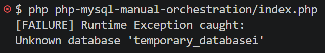
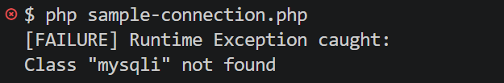
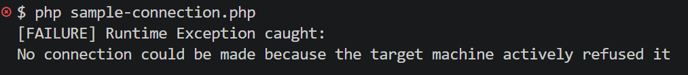
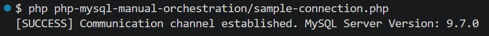

# System Diagnostics & Connectivity Lifecycle

This document provides a technical post-mortem of the connectivity lifecycle, capturing the iterative validation workflow of the manual bare-metal stack. It documents the deterministic error states encountered when transitioning from raw binary extraction to a fully orchestrated development environment.

## 1. Environment Baseline

To isolate the connection layer and test the communication channel between the PHP runtime and the MySQL daemon, place the following validation script (`test-connection.php`) in your workspace root:

```php
<?php

// Database connection parameters
$host = 'localhost'; // MySQL server host
$username = 'root'; // MySQL username
$password = ''; // MySQL password
$database_name = 'temporary_database'; // Database name
$database_port = 3306; // Database port

try {
    // Create connection
    $mysqli = new mysqli($host, $username, $password, $database_name, $database_port);
    echo "[SUCCESS] Communication channel established. MySQL Server Version: " . $mysqli->server_info . "\n";
    $mysqli->close();
} catch (Throwable $e) {
    echo "[FAILURE] Runtime Exception caught:\n";
    echo $e->getMessage() . "\n";
    exit(1);
}

?>
```

> [!TIP]
>
> ### Hands-On Setup Validation
>
> Before running the PHP verification script, ensure your targeted database actually exists in the engine storage layer.
>
> Launch your MySQL daemon (`mysqld --console`) in one terminal instance.
>
> Open a secondary terminal, connect via the client CLI (`mysql -u root`), and manually provision your schema:
>
> ```SQL
> CREATE DATABASE temporary_database;
> ```
>
> Once created, match the database name exactly in your `test-connection.php` connection string parameters to avoid a "Unknown database" engine fault.
>
> 

## 2. Missing Extension

- **Condition**

  PHP binaries are extracted, but the `mysqli` module has not been enabled within the configuration profile.

- **Error Observed**

  > 
  >
  > [FAILURE] Runtime Exception caught:
  > Class "mysqli" not found

- **Technical Justification**

  The Zend Engine throws an uncatchable error because it has no internal memory mapping or reference for the mysqli class. The driver DLL has not been loaded into the engine runtime space during process initialization.

- **Remediation Matrix**

  Update your `E:\PHP\php.ini` file to explicitly point the engine to your extension directory and strip the comment delimiter from the module declaration:

  ```ini
  ; Step 1: Explicitly define the absolute path to the Windows DLL modules
  extension_dir = "E:\PHP\ext"
  
  ; Step 2: Strip the scanning delimiter to compile the native driver
  extension = mysqli
  ```

## 3. Dormant Daemon

- **Condition**

  The PHP configuration is fully remediated and modules are active, but the underlying `mysqld` process is not running.

- **Error Observed**

  > 
  >
  > [FAILURE] Runtime Exception caught:
  > No connection could be made because the target machine actively refused it

- **Technical Justification**

  The PHP runtime successfully initializes the mysqli driver class and attempts a standard TCP handshake on port 3306. However, the operating system kernel drops the packet because no active daemon process is bound to or listening on that network socket.

- **Remediation Matrix**

  Open a dedicated terminal window and manually spawn the database server process in console mode to monitor incoming traffic segments:

  ```cmd
  mysqld --console
  ```

## 4. Authentication Mismatch

- **Condition**

  Both the PHP engine and the MySQL daemon are active, but the validation payload supplies incorrect credentials (e.g., an incorrect password or invalid user mapping).

- **Error Observed**

  > 
  >
  > [FAILURE] Runtime Exception caught:
  > Access denied for user 'rooot'@'localhost' (using password: YES)

- **Technical Justification**

  The network layer pipeline is operating correctly, and the TCP handshake is successful. The MySQL connection manager intercepted the incoming packet but rejected it during the handshake phase due to a cryptographic hash mismatch or a handshake failure against the internal system schema.

- **Remediation Matrix**

  Verify that your script credentials align exactly with your initialization strategy. If you ran `--initialize-insecure`, ensure that the password field is left entirely blank in your script string:

  ```php
  // Database connection parameters
  $host = 'localhost'; // MySQL server host
  $username = 'root'; // MySQL username
  $password = ''; // MySQL password
  $database_name = 'temporary_database'; // Database name
  $database_port = 3306; // Database port
  ```

## 5. Successful Orchestration

- **Condition**

  The PHP extensions are compiled into memory, the database daemon is listening on port 3306 (default port, can be changed via `my.ini`), and matching authorization criteria are supplied.

- **Execution Command**

  ```cmd
  php test-connection.php
  ```

- **Expected Output**

  > 
  > [SUCCESS] Communication channel established. MySQL Server Version: 9.7.0

- **Verification**

  The infrastructure boundaries are verified. The application runtime layer has verified end-to-end communication with the storage engine over local loopback sockets without relying on installer background services.
