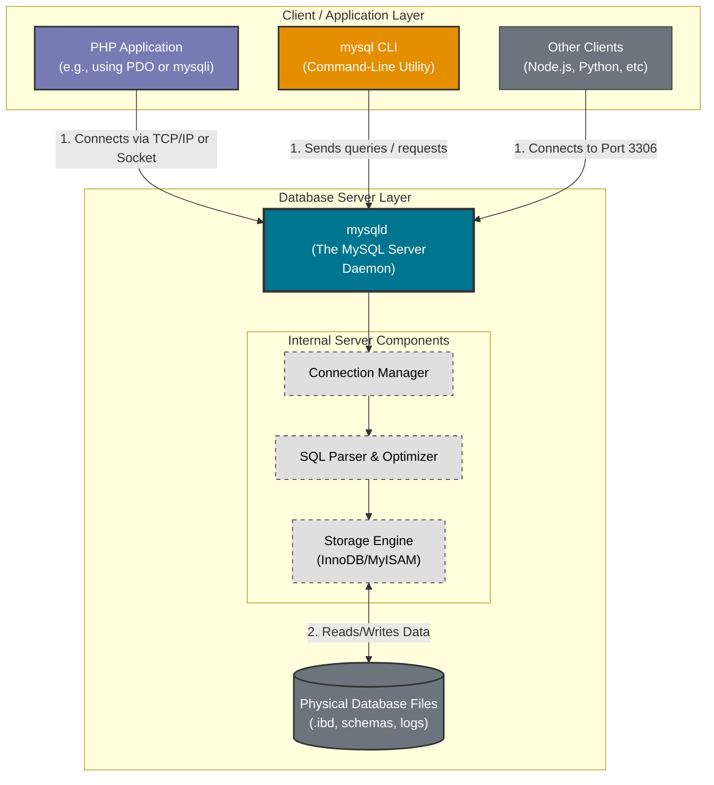

# Pure PHP 8.5+ & MySQL 9.7 Manual Bare-Metal Setup

A manually orchestrated PHP and MySQL development stack engineered for **portability**, **filesystem isolation**, and **low-overhead runtime management**.

Unlike bundled environments such as XAMPP or separate installers, this setup uses standalone binaries and manual configuration to provide tighter infrastructure control, predictable system behavior, and cleaner separation between the operating system and development tooling.

## Table of Contents

- [Architecture Goals](#architecture-goals)
- [Infrastructure Overview](#infrastructure-overview)
  - [PHP Runtime](#php-runtime-v856)
  - [MySQL Server](#mysql-server-v97)
- [Engineering Decisions](#engineering-decisions)
- [Environment Provisioning](#environment-provisioning)
  - [Phase 1 - PHP Runtime Provisioning](#phase-1---php-runtime-provisioning)
  - [Phase 2 - MySQL Server Initialization](#phase-2---mysql-server-initialization)
  - [Phase 3 - Runtime Execution & Validation](#phase-3---runtime-execution--validation)
- [MySQL Client Utilities & Backup Management](#mysql--client-utilities--backup-management)
  - [Difference Between `mysql` and `mysqld`](#difference-between-mysql-and-mysqld)
  - [Database Backup & Export Using `mysqldump`](#database-backup--export-using-mysqldump)
- [Operational Workflow](#operational-workflow)

## Architecture Goals

The environment is intentionally configured outside the operating system partition to achieve cleaner infrastructure boundaries and greater operational flexibility.

1. System Partition Protection

    Application binaries and database files are isolated from the OS drive to prevent uncontrolled storage growth and reduce filesystem clutter on `C:\`.

2. Persistent Development State

    By separating runtime infrastructure from the operating system, databases and development tooling remain intact even after OS reinstallation or migration.

3. Resource-Efficient Runtime Management

    Services are launched manually instead of running continuously as **Windows Services** (background running programs), eliminating unnecessary background resource consumption during inactive periods.

## Infrastructure Overview

### PHP Runtime (v8.5.6)

- Installed manually from standalone ZIP binaries.
- Hosted on the `E:\` partition for portability and filesystem isolation.
- Configured through a customized `php.ini`.
- Integrated globally through the Windows `%PATH%` environment variable.

### MySQL Server (v9.7)

The database layer operates as a manually controlled daemon instead of a persistent Windows Service.

- Dedicated `datadir` stored outside the OS partition.
- Manual bootstrap initialization.
- Console-based execution for live diagnostics and monitoring.
- MySQL Configuration

  ```ini
  [mysqld]
  basedir="E:\MySQL"
  datadir="E:\MySQL\data"
  port=3306
  ```

## Engineering Decisions

| Decision                       | Technical Rationale                                    | Outcome                                                   |
|--------------------------------|--------------------------------------------------------|-----------------------------------------------------------|
| Manual binary installation     | Avoid dependency on installer-managed registry entries | Improved portability and predictable filesystem structure |
| External `datadir` placement   | Prevent database growth from affecting OS stability    | Safer disk utilization and cleaner system maintenance     |
| Non-service MySQL architecture | Eliminate persistent background processes              | Lower idle resource consumption                           |
| Console-based daemon execution | Enable real-time logging and debugging                 | Easier runtime diagnostics during development             |

## Environment Provisioning

### Phase 1 - PHP Runtime Provisioning

- [ ] [Download the PHP Thread Safe ZIP binaries](https://downloads.php.net/~windows/releases/archives/php-8.5.6-Win32-vs17-x64.zip) Zip/Archive from [php.net](https://www.php.net/downloads.php)
- [ ] Extract the archive to `E:` and rename it to `PHP` so the path becomes `E:\PHP`
- [ ] Duplicate `php.ini-development`
- [ ] Rename the duplicate to `php.ini`
- [ ] Configure the `php.ini` to point to the extensions directory that contains the DLLs (Dynamic-Link Libraries):

  ```ini
  ; remove the `;` to uncomment the below line and define the path to .dll directory/folder
  extension_dir="ext"
  ; uncomment the desired extensions to get their modules enabled
  extension=mysqli
  ```

- [ ] Define a new Environment Variable (e.g., `PHP_HOME`) pointing to `E:\PHP` and prepend it in the `%PATH%` to enable global CLI access to the `php` executable.

> [!NOTE]
> Windows PHP extensions use `.dll` modules, whereas Linux environments typically use `.so` shared objects.

### Phase 2 - MySQL Server Initialization

- [ ] [Download the **MySQL Community Server**](https://dev.mysql.com/downloads/file/?id=550679) ZIP archive from [dev.mysql.com](https://dev.mysql.com/downloads/mysql/)
- [ ] Extract the archive to `E:` and rename it to `MySQL` so the path becomes `E:\MySQL`
- [ ] Define a new Environment Variable (e.g., `MYSQL_HOME`) pointing to `E:\MySQL\bin` and append it in the `%PATH%` to enable global CLI access to `mysqld`, `mysql`, and `mysqldump` executables.

#### Server Configuration

- [ ] Create a custom `my.ini` file inside the MySQL root directory:

  ```ini
  [mysqld]
  basedir="`E:\MySQL"
  datadir="E:\MySQL\data"
  port=3306`
  ```

> [!NOTE]
> `my.ini` is the MySQL daemon configuration file. The default settings can be overwritten such as the `data\` directory location and server port.

#### Database Engine Initialization

- [ ] Initialize the MySQL system tables and data directory structure:

  ```cmd
  mysqld --initialize-insecure --console
  ```

> [!WARNING]
>
> ### Production Security & Compliance Notice
>
> The implementation of `--initialize-insecure` and the use of blank/default credentials (`root` with no password) are strictly reserved for **isolated, local development simulations**.
>
> - **Credential Exposure:** Hardcoding or documenting default authentication configurations in shared repositories represents a severe security vulnerability.
> - **Production Safeguards:** In staging or production provisioning, secrets must be dynamically injected via secure environment variables or vault systems, and the daemon must be bootstrapped using `mysqld --initialize` to generate unique, cryptographically secure administrative credentials.

### Phase 3 - Runtime Execution & Validation

- [ ] Start the MySQL Daemon (Server)
- [ ] Launch the database server manually:

  ```cmd
  mysqld --console
  ```

  Running the daemon in console mode provides direct visibility into connection requests, startup logs, and runtime diagnostics.

#### Database Initialization

- [ ] Connect using the MySQL client (`mysql` CLI) using the default credentials (username: `root`, password: ` `)

  ```cmd
  mysql -u root
  ```

- [ ] Create project-specific schemas:

  ```cmd
  CREATE DATABASE temporary_database;
  CREATE DATABASE another_temporary_database;
  USE temporary_database;
  ```

  You can connect explicitly using `-u` (MySQL username), `-h` (host address) and `-P` (MySQL server port) respectively.

  ```cmd
  mysql -u root -h 127.0.0.1 -P 3306
  ```

- Validate successful communication between PHP and MySQL using a [simple mysqli connection test](./sample-connection.php).

> [!IMPORTANT]
>
> #### Connectivity Lifecycle & Diagnostics
>
> For a step-by-step technical walkthrough of common failure states—including missing extensions, dormant daemons, and authentication mismatches—refer to the [DIAGNOSTICS.md](./DIAGNOSTICS.md) guide.

## MySQL  Client Utilities & Backup Management

### Difference Between `mysql` and `mysqld`

Although both binaries belong to the MySQL ecosystem, they serve entirely different roles in the client-server architecture.

| Binary   | Role                   | Purpose                                                                                                                   |
|----------|------------------------|---------------------------------------------------------------------------------------------------------------------------|
| `mysqld` | Database Server Daemon | Starts and manages the MySQL database engine, handles storage operations, authentication, queries, and client connections |
| `mysql`  | Command-Line Client    | Connects to a running MySQL server instance to execute SQL queries and administrative commands                            |

### Conceptual Flow



> [!IMPORTANT]
>
> - `mysqld` must be running before any client can connect.
> - `mysql` acts only as an interface for interacting with the server.

### Database Backup & Export Using `mysqldump`

The `mysqldump` utility is a logical backup tool used to export database schemas and records into portable SQL dump files.

#### Common Use Cases

- Database backup before risky schema changes
- Migrating databases between systems
- Versioning development datasets
- Sharing portable database snapshots with teams
- Disaster recovery and restoration

#### Export a Single Database

```cmd
mysqldump -u root temporary_database > temporary_database.sql
```

This generates a SQL dump file containing:

- `CREATE TABLE` statements
- Schema definitions
- Insertable row data
- Indexes and constraints

#### Export Multiple Databases

```cmd
mysqldump -u root --databases temporary_database another_temporary_database > databases_backup.sql
```

#### Export All Databases

```cmd
mysqldump -u root --all-databases > full_backup.sql
```

#### Restore a Database From Backup

```cmd
mysql -u root temporary_database < temporary_database.sql
```

This replays the SQL dump into the target database.

## Operational Workflow

Because the stack follows a fully manual execution model, no background services persist between sessions.

### Startup Procedure

- [ ] Open a dedicated terminal instance and launch the database daemon:

  ```cmd
  mysqld --console
  ```

> [!IMPORTANT]
> Keep the terminal active to monitor logs and runtime activity.

### Safe Shutdown Procedure

- [ ] Gracefully terminate the MySQL server to avoid corruption or incomplete writes:

  ```cmd
  mysqladmin -u root shutdown
  ```

  This ensures clean unmounting of active connections and proper storage synchronization.
